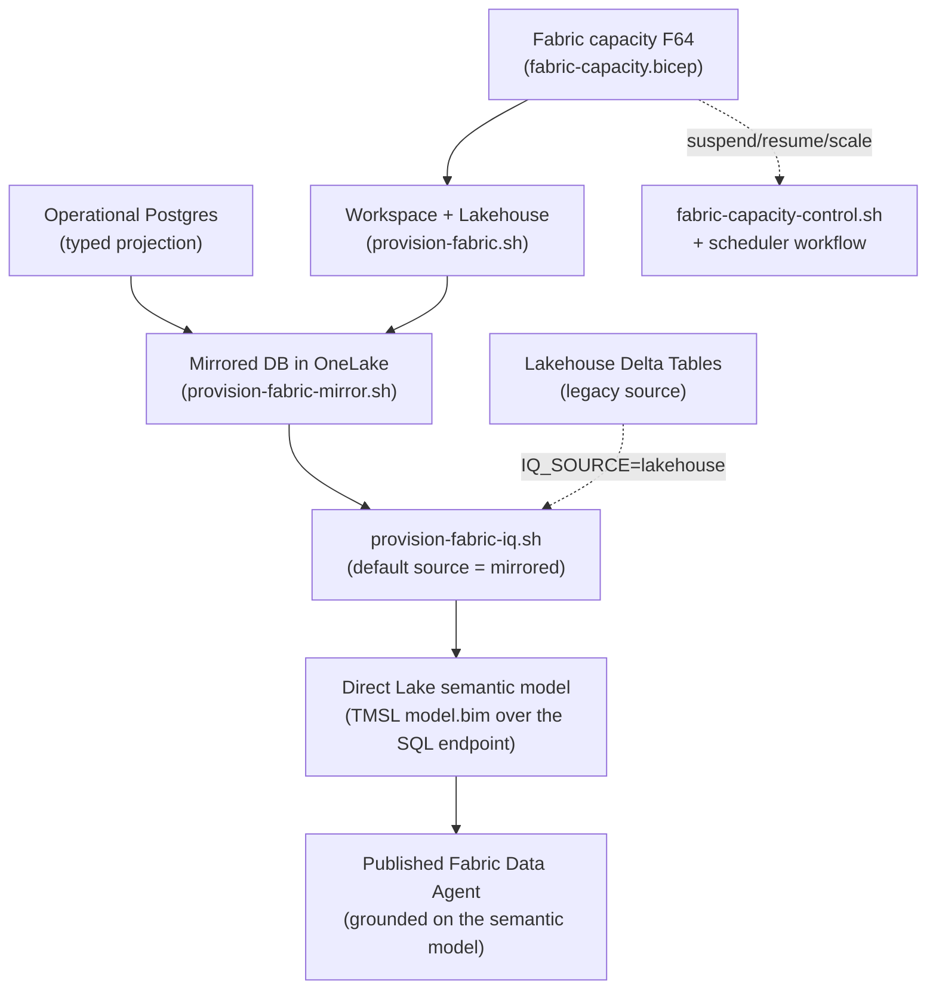
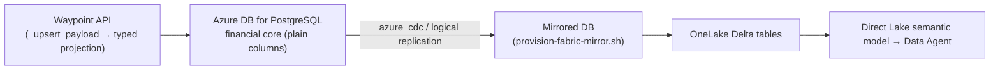

# Fabric IQ — Direct Lake semantic model + Data Agent as IaC

Waypoint's **Fabric IQ** is the AI layer for operational financial analytics: a **Direct Lake
semantic model** plus a **published Fabric Data Agent** that answers natural-language questions about
suppliers, invoices, invoice lines and reconciliation findings.

The interactive `Deploy_EnterpriseLakehouse_VendorModel` notebook was the proof of concept. This doc
describes the **notebook-free, idempotent IaC** that replaces it: everything runs from the same
gated, repeatable pipeline that already provisions the capacity + workspace + lakehouse. There is no
notebook, no Spark session, and no `sempy_labs` / `notebookutils` runtime dependency — only the
Microsoft Fabric public REST API and the OneLake DFS REST endpoint.

> **Grounding source.** By default (`WAYPOINT_FABRIC_IQ_SOURCE=mirrored`) Fabric IQ builds the
> semantic model + Data Agent over the **mirrored operational Postgres financial core** — the typed
> projection of `suppliers`, `invoices`, `invoice_lines` and `reconciliation_findings` replicated into
> OneLake by Fabric Mirroring (see below). The legacy `lakehouse` source (the keystone corpus Delta
> `Tables/`, owned/written by ledgerfield) is still selectable with `WAYPOINT_FABRIC_IQ_SOURCE=lakehouse`.

---

## Architecture

| Concern | Where | ARM/Bicep? |
| --- | --- | --- |
| Fabric capacity (**F64** default) | `infra/fabric-capacity.bicep` (`Microsoft.Fabric/capacities`) | yes |
| Workspace + lakehouse + role grants | `infra/scripts/provision-fabric.sh` (Fabric REST) | no |
| **Source mirror** (operational Postgres → OneLake) | `infra/scripts/provision-fabric-mirror.sh` → `provision_fabric_mirror.py` (Fabric REST) + `infra/postgres-flexible.bicep` (`enableFabricMirroring`) + API-startup role bootstrap | mixed |
| **Direct Lake semantic model + Data Agent** | `infra/scripts/provision-fabric-iq.sh` → `provision_fabric_iq.py` (Fabric REST + OneLake DFS) | no |
| Capacity suspend / resume / scale | `infra/scripts/fabric-capacity-control.sh` (ARM via `az rest`) | control plane |
| Scheduled auto-suspend | `.github/workflows/fabric-capacity-scheduler.yml` | — |
| Provisioning gates | `Waypoint:Fabric:ProvisionEnabled` + `Waypoint:Fabric:IqEnabled` (`apphost.cs`, publish only) | — |

Semantic models and Data Agents are **not** ARM/Bicep item types, so — exactly like the workspace and
lakehouse — Fabric IQ is created through the Fabric **items-with-definition** REST API. Both the
semantic model (TMSL `model.bim`) and the Data Agent (multi-part JSON definition) are declared, and
every create is *look-up-by-display-name → updateDefinition* so re-runs update in place rather than
duplicating.



---

## Source data — Fabric Mirroring of the operational Postgres

FabricIQ is the **quantitative / transactional reconciliation plane**. Contracts and policies now
live in a FoundryIQ knowledge base, and invoices flow to WorkIQ, so FabricIQ grounds on a zero-ETL,
continuously replicated **mirror of the operational Azure Database for PostgreSQL financial core**
rather than the keystone-seeded lakehouse corpus. Mirrored tables (the financial/transactional core
only): `suppliers`, `invoices`, `invoice_lines`, `reconciliation_findings`.

Mirroring replicates **typed columns**, and it cannot mirror `jsonb`/`json` columns and does not
guarantee replication of generated columns. The operational store is JSONB-document shaped, so the
API projects the financial core onto **plain, typed physical columns** (numeric measures, real dates,
text dimensions + join keys) that it populates on every write (`api/app/common/repository.py`,
`_PROJECTED_COLUMNS` + `_SCHEMA_SQL`). Those plain columns are what replicates into OneLake as Delta,
and what the Direct Lake semantic model reads.



### Prerequisites

- **Postgres tier** — mirroring does **not** support the Burstable tier, so the default moves to
  `GeneralPurpose` / `Standard_D2ds_v5` (`infra/postgres-flexible.bicep`, overridable via
  `Waypoint:Postgres:SkuName` / `SkuTier`).
- **Source-server prep (IaC part)** — set `enableFabricMirroring=true`
  (`Waypoint:Fabric:MirrorEnabled`). The bicep then enables the **System-Assigned Managed Identity**
  (the one hard prerequisite that is a genuine ARM property; `azure_cdc` uses it to authenticate to
  OneLake) and pre-tunes the customer-settable capacity parameters `max_worker_processes` (+3 per
  mirrored database) and `azure_cdc.max_fabric_mirrors`.
- **Mirroring role (API-bootstrapped)** — the dedicated `fabric_user` role
  (`LOGIN, CREATEDB, CREATEROLE, REPLICATION`, plus `azure_cdc_admin` where present, plus ownership
  of the four mirrored tables — required for `CREATE PUBLICATION`) is provisioned **by the API at
  startup** (`api/app/common/database.py::_bootstrap_fabric_mirroring_role`) using the privileged
  admin bootstrap connection (`APP_DATABASE_BOOTSTRAP_CONNECTION`). On the mirror path that
  connection is wired from the `postgres-admin-password` secret that keystone generate-once's into
  the same `kv-keystone-<hash>` vault: `deploy.yml` reads it and, only when present, sets
  `Parameters__postgres_admin_password` + `Waypoint__Fabric__AdminBootstrapEnabled=true` so `apphost`
  declares the parameter and emits the bootstrap connection. When the secret is absent the step is a
  graceful no-op (Aspire never demands the parameter) and mirroring still works if `fabric_user`
  already exists. This keeps the deploy pipeline free of any admin connection string or `psql`.
  `infra/scripts/fabric-mirror-role.sql` is retained for local / out-of-band validation only (kept in
  lockstep with the Python bootstrap).
- **Mirror credential (one secret, keystone-repeatable)** — the single `fabric-mirror-password` is
  generated **once** into the keystone Key Vault by the deploy (`kv-keystone-<hash>`, the same store
  that holds `postgres-app-password` / `waypoint-api-keys`) and reused on every re-run. It is shared
  by both the API (which creates the role with it, via `APP_FABRIC_MIRROR_PASSWORD`) and the
  deploy-time Fabric connection (which reads it back from the vault). No human-set GitHub secret is
  required; `FABRIC_MIRROR_PASSWORD` remains only as an optional override.
- **Firewall** — the source server must allow Azure services (or use a VNet data gateway), otherwise
  the Fabric backend cannot reach it during connection create.
- **Source-server SAMI → workspace `Contributor` (auto-granted)** — `azure_cdc` writes the mirrored
  Delta tables into OneLake **as the source PostgreSQL server's system-assigned managed identity**,
  so that SAMI must hold a *write-capable* workspace role. `provision-fabric-mirror.sh` resolves the
  server's `identity.principalId` from its FQDN and `provision_fabric_mirror.py` idempotently grants
  it `Contributor` on the workspace **before** `startMirroring`. Without it the mirror reports
  `Running` but every table fails with `azure_cdc: CDC_ERR_SYS_ONELAKE_PERMISSION_DENIED` and no
  data ever lands in `Tables/` — a silent, data-empty "success". Override via
  `WAYPOINT_FABRIC_MIRROR_SAMI_OBJECT_ID` if ARM resolution is unavailable.

### Source-server enablement (one-time, portal-only)

> [!IMPORTANT]
> The PostgreSQL side of Fabric Mirroring is finished by a **portal-orchestrated control-plane
> workflow that has no public ARM/CLI/REST API** (verified live, 2026-06). That workflow preloads and
> **registers the proprietary `azure_cdc` extension per database**, sets `wal_level=logical`, and
> flips `azure.fabric_mirror_enabled=on` at the end — Microsoft's docs state this parameter "is set
> automatically at the end of the server enablement workflow, so you shouldn't change it manually,"
> and `shared_preload_libraries` rejects the `azure_cdc` value outright. Setting those parameters by
> hand leaves the server **"not ready for Mirroring"** (the mirror starts, then Stops).
>
> So after `enableFabricMirroring=true` provisions the SAMI + capacity params, a human performs this
> **once per server**:
>
> 1. Azure portal → the flexible server → **Fabric mirroring** → **Get started**.
> 2. **Prepare** (this preloads + registers `azure_cdc` and sets the WAL params) → **Restart** and
>    wait until the blade reports the server is **ready for mirroring**.
> 3. Re-run the deploy (or `provision-fabric-mirror.sh`) — everything downstream is fully automated.
>
> If Azure ships a public API for this enablement, wire it into `postgres-flexible.bicep` /
> `provision-fabric-mirror.sh` and delete this manual step. Until then `provision_fabric_mirror.py`
> fails fast with a remediation message pointing back here when it detects the "not ready" state.

### What `provision-fabric-mirror.sh` does

1. Ensures a Fabric **connection** to the source server (type `AzurePostgreSQL`, or reuses
   `WAYPOINT_FABRIC_MIRROR_CONNECTION_ID`) using the shared `fabric-mirror-password` (read from the
   keystone Key Vault; the `fabric_user` role itself is bootstrapped by the API, not here).
2. Creates a **Mirrored Azure Database for PostgreSQL** item whose `mirroring.json` mounts the four
   tables (creating the item auto-starts mirroring), then polls the status.

Every step is look-up-before-write and re-runnable; changing the mounted table set on a running
mirror requires stop + reseed, so an existing mirror is reused as-is.

---

## What `provision-fabric-iq.sh` does

1. Resolves the workspace (GUID or display name) and the grounding source's **SQL analytics
   endpoint**:
   - **mirrored** (default): the Mirrored Azure Database for PostgreSQL item
     (`GET /v1/workspaces/{id}/mirroredDatabases` → `sqlEndpointProperties.connectionString`), named
     by `WAYPOINT_FABRIC_MIRRORED_DATABASE_NAME` (default `WaypointMirror`).
   - **lakehouse**: the lakehouse endpoint
     (`GET /v1/workspaces/{id}/lakehouses/{id}` → `sqlEndpointProperties.connectionString`).
2. Determines each table's **typed column schema**:
   - **mirrored**: from the authoritative typed projection declared in `MIRRORED_TABLE_SCHEMA`
     (`suppliers`, `invoices`, `invoice_lines`, `reconciliation_findings`), kept in lock-step with the
     API's `repository._PROJECTED_COLUMNS` by `infra/scripts/test_fabric_iq_schema.py`. This is
     deterministic and needs no OneLake read, so the model builds even before rows finish replicating.
   - **lakehouse**: by parsing each table's Delta transaction log
     (`Tables/<t>/_delta_log/*.json` → latest `metaData.schemaString`) over OneLake DFS — no Spark.
   Both honor an optional `WAYPOINT_FABRIC_IQ_TABLES` allow-list.
3. Builds a **Direct Lake TMSL `model.bim`** (partitions in `directLake` mode over a
   `Sql.Database(server, db)` expression, using the mirrored schema `_public` or lakehouse `dbo`) with
   model/table/column descriptions for AI grounding, and creates/updates the semantic model.

   > **Mirrored schema is `_public`, not `public`.** Fabric materializes the source Postgres
   > `public` schema on the SQL analytics endpoint as **`_public`** (underscore-prefixed) because
   > `public` is a T-SQL reserved keyword. The Direct Lake partition `schemaName` must be `_public`
   > or framing fails with *"cannot access the source Delta table"*. This is the default
   > (`WAYPOINT_FABRIC_MIRRORED_SCHEMA`), and downstream consumers (e.g. Forge's headless
   > mirrored-SQL read via `FABRIC_MIRRORED_SCHEMA`) must use `_public` for the same reason.
4. Creates/updates and **publishes** a **Fabric Data Agent** wired to that semantic model, with
   invoice-assurance steering instructions.

It is invoked automatically by:

- the azd `postprovision` hook (`azure.yaml`, after `provision-fabric.sh`), and
- the deploy workflow's **"Provision Fabric IQ (semantic model + Data Agent)"** step.

### First-run ordering (soft skip)

The **mirrored** source resolves the mirrored database item by name and uses the declared typed
schema, so it does not depend on a table listing and there is nothing to soft-skip — but the mirrored
DB must exist first (run `provision-fabric-mirror.sh`, which requires the one-time portal enablement
above). If the item is missing, IQ fails fast telling you to provision the mirror.

The **lakehouse** source has a different ordering wrinkle: in the keystone one-click flow, ledgerfield
uploads the corpus **after** Waypoint deploys and emits the workspace coordinates. So on a first
deploy the lakehouse may have **no Tables yet**. The deploy step sets
`WAYPOINT_FABRIC_IQ_ALLOW_EMPTY=true`, which turns "no Tables" into a **soft skip** (exit 0) instead of
a failure. Because the whole thing is idempotent, the next deploy (or a manual run) after the corpus
is uploaded completes Fabric IQ. Outside CI the default is a hard error, so you notice a genuinely
empty lakehouse.

---

## Using F64

F64 is the Fabric IQ baseline and the new default in `infra/fabric-capacity.bicep` /
`apphost.cs` (`Waypoint:Fabric:SkuName`). Fabric **Data Agents / Copilot require a paid F-SKU**
(not Trial capacity), and F64 unlocks the full Copilot experience. Override per-environment with the
`fabric_sku_name` deploy input or `WAYPOINT_FABRIC_SKU_NAME` repo variable if you want a different
SKU. **F64 bills while Active** — see cost control below.

### Tenant prerequisites

Beyond the service-principal Developer settings already documented in
[`onelake-corpus.md`](./onelake-corpus.md), the Fabric tenant must have the **Copilot / AI (Fabric
data agent)** tenant settings enabled for the deploy identity, and the capacity must be **Active**
(Data Agents don't work on a suspended or Trial capacity). In `caldova` these are enabled
org-wide; verify in the Fabric Admin portal for other tenants.

---

## Cost control — suspend / resume / scale

F64 is expensive when idle, so cost control is first-class and **idempotent + repeatable**.

### On-demand (script)

`infra/scripts/fabric-capacity-control.sh` drives the `Microsoft.Fabric/capacities` control plane via
`az rest`. Every action is a no-op when the capacity is already in the target state:

```sh
export WAYPOINT_FABRIC_CAPACITY_NAME=waypointcorpus
export AZURE_RESOURCE_GROUP=<rg>

./infra/scripts/fabric-capacity-control.sh status        # print state + SKU
./infra/scripts/fabric-capacity-control.sh suspend       # stop compute billing
./infra/scripts/fabric-capacity-control.sh resume        # before a demo
./infra/scripts/fabric-capacity-control.sh scale F2      # resize down but stay queryable
./infra/scripts/fabric-capacity-control.sh scale F64     # resize back up
```

- **Suspend** stops compute billing entirely; OneLake reads and the Data Agent are offline until you
  resume, and the API degrades to URI-only document metadata (nothing 500s).
- **Scale** keeps the capacity Active (still queryable) at a smaller SKU — use it when you want the
  model/agent reachable but cheaper. Note Data Agent/Copilot features still need a sufficiently large
  paid SKU.

### Scheduled (workflow)

`.github/workflows/fabric-capacity-scheduler.yml`:

- **`schedule`** (cron, `0 1 * * *` by default) **auto-suspends** every night so an idle F64 never
  bills overnight. Adjust or remove the cron to taste.
- **`workflow_dispatch`** runs `status | suspend | resume | scale` on demand (with an optional `sku`
  for scale) — e.g. resume before a demo, suspend after.

Resume is **never** on a schedule, so the capacity is only ever turned back on intentionally. The job
is skipped entirely when `WAYPOINT_FABRIC_CAPACITY_NAME` is unset, so the cron is a safe no-op in
repos that don't run the corpus lake.

Required repo config: secrets `AZURE_CLIENT_ID` / `AZURE_TENANT_ID` / `AZURE_SUBSCRIPTION_ID` /
`AZURE_RESOURCE_GROUP`, and variable `WAYPOINT_FABRIC_CAPACITY_NAME`.

---

## Enabling Fabric IQ

Fabric IQ is gated behind `Waypoint:Fabric:IqEnabled` and off by default, so existing deploys are
unaffected. To turn it on, in addition to the OneLake corpus settings in
[`onelake-corpus.md`](./onelake-corpus.md):

### azd / local

```sh
azd env set Waypoint:Fabric:IqEnabled          true
azd env set Waypoint:Fabric:SemanticModelName  CaldovaIQ          # optional
azd env set Waypoint:Fabric:DataAgentName      WaypointDataAgent   # optional

# Consumed by the postprovision hook (infra/scripts/provision-fabric-iq.sh):
azd env set WAYPOINT_FABRIC_IQ_ENABLED        true
azd env set WAYPOINT_FABRIC_IQ_SOURCE         mirrored            # or "lakehouse"
azd env set WAYPOINT_FABRIC_MIRRORED_DATABASE_NAME  WaypointMirror   # mirrored source
azd env set WAYPOINT_FABRIC_LAKEHOUSE_NAME    corpus              # lakehouse source only
# workspace GUID is published by provision-fabric.sh as APP_ONELAKE_WORKSPACE; or set it explicitly:
azd env set WAYPOINT_FABRIC_WORKSPACE         <workspace-guid>
```

### GitHub deploy workflow

Set the `fabric_iq_enabled` input (keystone umbrella / `workflow_dispatch`) or the matching repo
variables:

| Input | Variable | Default |
| --- | --- | --- |
| `fabric_iq_enabled` | — | `false` |
| `fabric_mirror_enabled` | — | `false` |
| — | `WAYPOINT_FABRIC_MIRROR_SERVER` (source Postgres FQDN; gates the mirror step) | — |
| — | `WAYPOINT_FABRIC_IQ_SOURCE` | `mirrored` |
| — | `WAYPOINT_FABRIC_MIRROR_NAME` (mirrored DB item name) | `WaypointMirror` |
| `fabric_semantic_model_name` | `WAYPOINT_FABRIC_SEMANTIC_MODEL_NAME` | `CaldovaIQ` |
| `fabric_data_agent_name` | `WAYPOINT_FABRIC_DATA_AGENT_NAME` | `WaypointDataAgent` |
| `fabric_sku_name` | `WAYPOINT_FABRIC_SKU_NAME` | `F64` |
| — | `WAYPOINT_FABRIC_CONSUMER_MEMBERS` (consumer MI object ids granted workspace `Viewer`) | — |

> [!NOTE]
> The mirror credential needs **no GitHub secret**. When `fabric_mirror_enabled` is `true`, the deploy
> generates `fabric-mirror-password` once into the keystone Key Vault and reuses it on every run —
> the API bootstraps the `fabric_user` role with it and the Fabric connection reads it back. The
> `FABRIC_MIRROR_PASSWORD` secret is an optional override only.

The deploy job emits `fabric_semantic_model` / `fabric_data_agent` (display names) and surfaces them to
the API as `APP_FABRIC_IQ_SEMANTIC_MODEL` / `APP_FABRIC_IQ_DATA_AGENT` for `/config` deep-linking.

**For Forge:** it also emits the GUIDs `fabric_workspace_id`, `fabric_semantic_model_id` and
`fabric_data_agent_id`. Forge's `operations-data-expert` needs `fabric_workspace_id` +
`fabric_data_agent_id` to build the Foundry→Fabric connection that un-stubs the live evidence path.

### Consumer workspace access (Forge project MI → `Viewer`)

Forge's `operations-data-expert` grounds on Fabric two ways: interactively via the WaypointDataAgent
(user OBO) and headlessly via a deterministic read of the mirrored SQL analytics endpoint. Each path
authenticates as a **different** principal, and each needs a Fabric **workspace role**:

- **Interactive / OBO** — the signed-in user's token (no workspace grant needed beyond the user's own).
- **Headless read** — inside the hosted-agent container, `DefaultAzureCredential` resolves to the
  **per-agent Foundry AgentIdentity** that the platform provisions for the agent (display name
  `…-operations-data-expert-AgentIdentity`, `appid == oid`), **not** the Foundry project MI. That
  AgentIdentity is the principal that actually opens the TDS connection, so it is the one that must hold
  the workspace role. (The project MI and account MI are also granted for the interactive/tooling paths.)

Rather than a hand-made `roleAssignments` POST, set the repo variable `WAYPOINT_FABRIC_CONSUMER_MEMBERS`
to the consumer object id(s) (comma- or newline-separated; each entry is
`<object_id>[:<type>[:<label>]]` and a bare id is treated as a `ServicePrincipal`/managed identity).
The deploy then idempotently grants each one workspace `Viewer` via `ensure-fabric-workspace-roles.sh`
on both the provision and reuse paths — so a fresh environment reproduces the grant automatically.
Because these object ids are deployment-specific, keystone injects them; no GUID is hardcoded in this repo.

> [!IMPORTANT]
> The mirrored SQL analytics endpoint is **read-only** and rejects security DDL: `CREATE USER [...] FROM
> EXTERNAL PROVIDER` fails with `Msg 22424, CREATE USER is not a supported statement type`. Contained
> database users only exist on Fabric **Warehouse** items — **not** on a mirrored endpoint. Access is
> therefore **RBAC/identity-based only**: the principal that connects must hold a Fabric **workspace
> role** (`Viewer` conveys `ReadData`, which is sufficient for the headless SELECTs). A principal that
> is not on the workspace is rejected at login with `18456 (authentication failed)`. The agent degrades
> gracefully to an empty evidence contract until the read succeeds.

> [!NOTE]
> The per-agent AgentIdentity object id is stable for the life of the agent but is **per-agent /
> per-Foundry-project**. If the agent is deleted and recreated (or a brand-new environment is stood
> up), a new AgentIdentity id is minted and must be re-supplied via `WAYPOINT_FABRIC_CONSUMER_MEMBERS`
> (keystone injects the deployment-specific id). The tenant **"Service principals can use Fabric APIs"**
> setting must also be enabled (a tenant-admin toggle, not IaC).

---

## Idempotency + repeatability summary

- **Capacity** — Bicep is declarative; re-`provision` is a no-op.
- **Workspace / lakehouse / roles** — `provision-fabric.sh`, look-up-before-create.
- **Semantic model / Data Agent** — `provision-fabric-iq.sh`, look-up-before-create then
  `updateDefinition`; safe to run on every deploy.
- **Cost control** — `fabric-capacity-control.sh` no-ops when already in the target state; the
  scheduler can run nightly without side effects.
