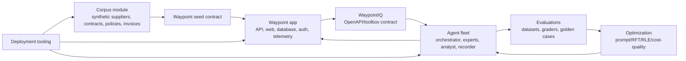

# Architecture

Waypoint demonstrates a production-style AI application architecture through the fictional Caldova invoice assurance scenario.

## System responsibilities

| Layer | Path | Responsibility |
| --- | --- | --- |
| Application | `apps/waypoint/` | System of record for invoices, findings, cases, runs, recommendations, approvals, audit, API, web UI, auth, telemetry, and persistence. |
| Corpus | `modules/corpus/` | Synthetic business ground truth: suppliers, contracts, policies, invoice scenarios, seed data, generated documents, OneLake and knowledge-base upload tooling. |
| Agents | `modules/agents/` | Orchestrators, evidence experts, analyst surfaces, WaypointIQ contracts, prompts, toolboxes, and write-boundary agents. |
| Evaluations | `modules/evals/` | Datasets, graders, calibration, quality gates, and repeatable evaluation plans. |
| Optimization | `modules/optimization/` | Prompt optimization, RFT/RLE materials, cost-quality views, promotion metadata, and telemetry-backed improvement planning. |
| Deployment | `tools/deploy/` | Environment discovery, preflight, Key Vault, MSAL, OIDC, seed import, agent/app wiring, and orchestration scripts. |

## Flow

Waypoint remains the governed boundary. Agents can gather evidence and propose actions, but writes, approvals, and audit happen through Waypoint contracts.

## Design intent

The repository is structured to feel like a real enterprise codebase while still teaching the lifecycle of an AI application:

1. Establish business truth.
2. Build the system of record.
3. Add governed agents.
4. Measure quality.
5. Improve behavior.
6. Deploy and operate the full system.
